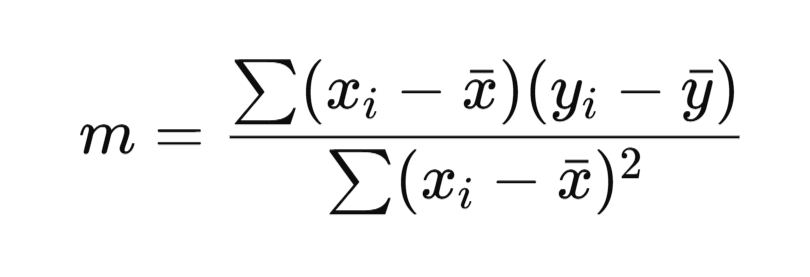

# Predictive Analysis with NumPy — Linear Regression from Scratch

**Purpose:** This README shows a simple, self-contained example of predictive analysis using **NumPy only**.  
We fit a **linear regression** model (least squares) by hand to predict student marks from hours studied.

---

## 1. Overview

Predictive analysis uses historical data to forecast future values. Here we use a tiny dataset of `Hours Studied` vs `Marks Scored` and fit a straight line:
 **`y = m x + c`**
where `m` is the slope and `c` is the intercept. We compute `m` and `c` using the ordinary least squares (OLS) formulas and then predict marks for new study-hours values.

---

## 2. Dataset (toy)
We use a tiny, easy-to-follow dataset:
```text
Hours Studied:  [1, 2, 3, 4, 5]
Marks Scored:   [30, 40, 50, 60, 70]
```
This dataset is intentionally linear so the fitted line will be exact for demonstration.

---

## 3. Code: Linear Regression with NumPy

```python
import numpy as np

# 1) Data (NumPy arrays)
hours = np.array([1, 2, 3, 4, 5], dtype=float)
marks = np.array([30, 40, 50, 60, 70], dtype=float)

# 2) Compute means
x_mean = np.mean(hours)     # x̄
y_mean = np.mean(marks)     # ȳ

# 3) Compute slope (m) using OLS formula
numerator = np.sum((hours - x_mean) * (marks - y_mean))     #xi - x̄
denominator = np.sum((hours - x_mean)**2)                   # yi - ȳ
m = numerator / denominator

# 4) Compute intercept (c), where the line crosses the y-axis
c = y_mean - m * x_mean

# 5) Show the linear equation
print(f"Fitted line: y = {m:.4f} * x + {c:.4f}")

# 6) Predict for a new value (example: 6 hours)
new_hours = 6.0
predicted_marks = m * new_hours + c
print(f"Predicted marks for {new_hours} hours: {predicted_marks:.4f}")
```

**Expected console output (approx):**
```
Fitted line: y = 10.0000 * x + 20.0000
Predicted marks for 6.0 hours: 80.0000
```

### What is OLS?
OLS (Ordinary Least Squares) is the most common method used in linear regression.
It finds the best fit line for data points by minimizing the sum of squared errors (differences between predicted and actual values).

Formula for a line:   **`y = m x + c`**
where
- m = slope (rate of change of y with respect to x)
- c = intercept (value of y when x = 0)


OLS Formula for slope (m): 

---

## 4. Plotting the result (optional)
You can visualize the data and fitted line to make the prediction tangible. Below code saves a PNG if you want a visual:

```python
import numpy as np
import matplotlib.pyplot as plt

# Data (same as above)
hours = np.array([1, 2, 3, 4, 5], dtype=float)
marks = np.array([30, 40, 50, 60, 70], dtype=float)

# Fit (reuse formulas)
x_mean = np.mean(hours)
y_mean = np.mean(marks)
m = np.sum((hours - x_mean) * (marks - y_mean)) / np.sum((hours - x_mean)**2)
c = y_mean - m * x_mean

# Plot
plt.scatter(hours, marks)
# regression line for plotting: generate smooth x values
x_line = np.linspace(hours.min(), hours.max(), 100)
y_line = m * x_line + c
plt.plot(x_line, y_line)
plt.xlabel("Hours Studied")
plt.ylabel("Marks Scored")
plt.title("Linear Regression (NumPy)")
plt.grid(True)

# Save file
plt.savefig("regression_plot.png", dpi=150)
print("Saved regression_plot.png (current directory)")
```

> **Note:** Matplotlib is used **only** for visualization. The predictive computation uses NumPy exclusively.

---
